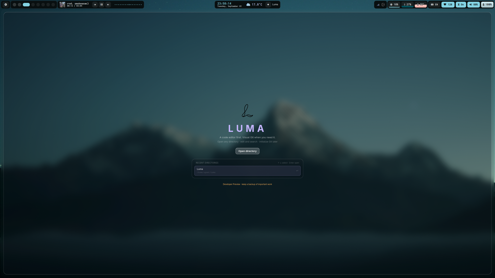
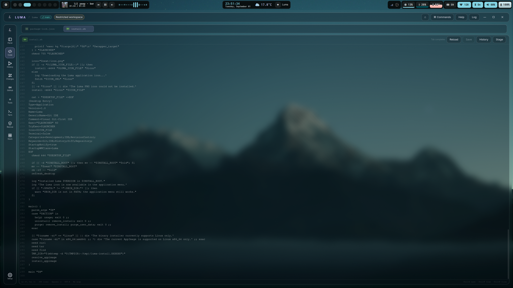
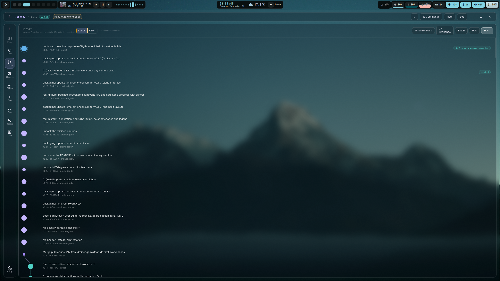
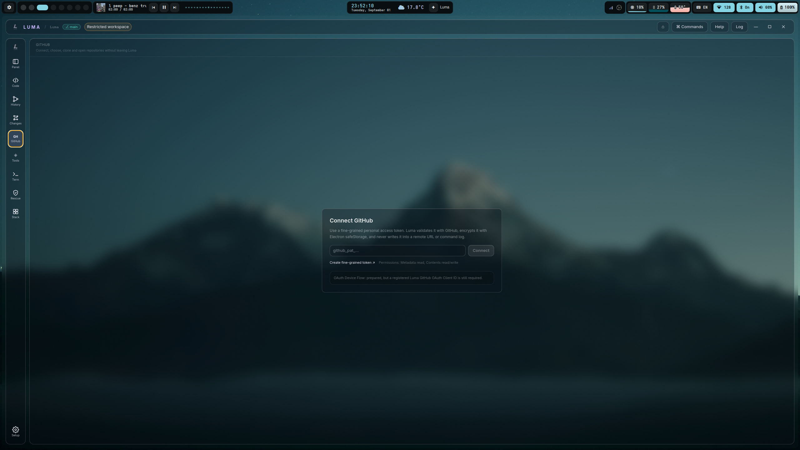
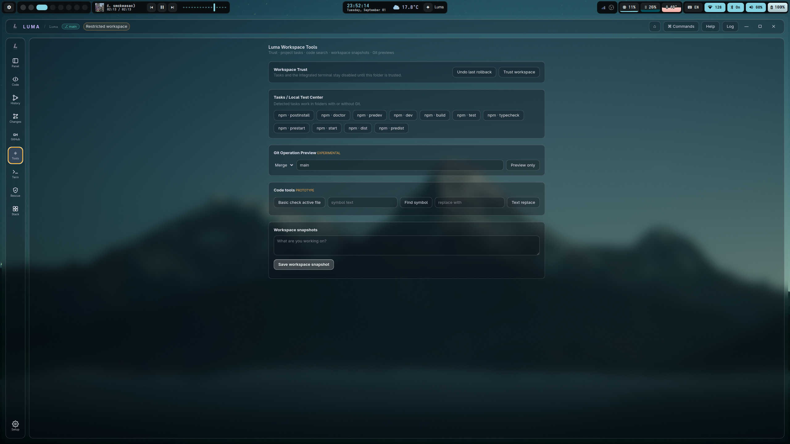
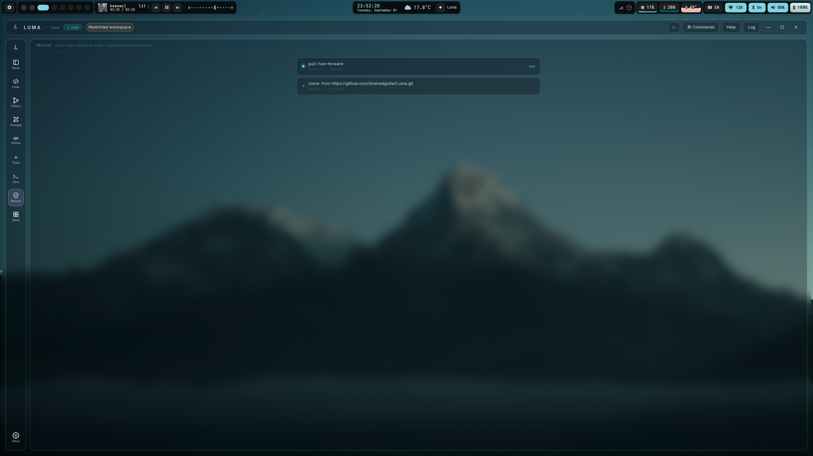
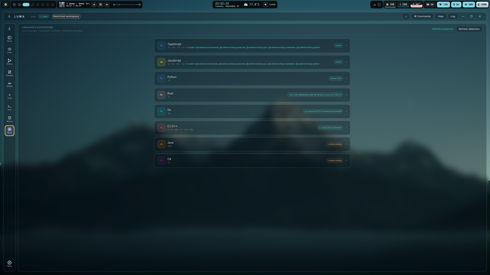
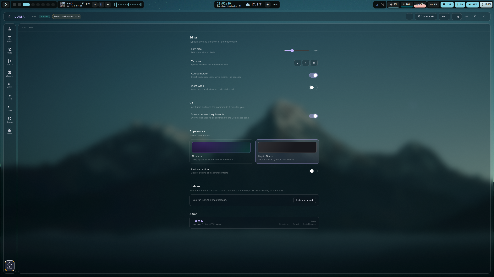

<div align="center">


# Luma

**See what Git will do before it does it.**

A Linux-first visual Git workspace: understandable history, previewable operations, and recovery from mistakes.

  

</div>

> [!WARNING]
> Luma 0.2 is a developer preview. Keep a remote backup and begin with non-critical repositories.

## Why Luma?

Most IDEs treat Git as a sidebar. Luma treats history as the workspace itself: inspect commits in a visual web, preview a rewrite before applying it, and keep a recovery point before moving HEAD.

## Install

One command — installs to `~/.local`, adds Luma to your application menu, no Node.js needed:

```sh
bash -c "$(curl -fsSL https://raw.githubusercontent.com/drainedgodw/Luma/main/install.sh)"
```

The installer works like a tiny pacman/AUR: it resolves the right artifact, verifies it, and swaps the install atomically. The same command installs and updates. Remove with `-- --uninstall` (keep settings) or `-- --purge` (remove everything).

Manual download is also available from [GitHub Releases](https://github.com/drainedgodw/Luma/releases). Every artifact carries a SHA-256 checksum and a keyless cosign bundle (`*.sigstore.json`) signed by this repo's GitHub Actions identity — the installer verifies the checksum always and the signature whenever `cosign` is present:

```sh
cosign verify-blob --bundle Luma-0.2.0.AppImage.sigstore.json \
  --certificate-identity-regexp 'https://github[.]com/drainedgodw/Luma/[.]github/workflows/release[.]yml@.*' \
  --certificate-oidc-issuer https://token.actions.githubusercontent.com \
  Luma-0.2.0.AppImage
```

### From source

```sh
git clone https://github.com/drainedgodw/Luma.git
cd Luma
bash scripts/bootstrap.sh dev
```

The bootstrap downloads a private, compatible Node 22 and a private CPython 3.11 (for the node-pty native build) into the ignored `.luma/` directory — it does not touch your system Node, Python or shell config. See `bash scripts/bootstrap.sh --help` for test/build/clean commands.

## Features

- **History** — commit graph in two views: classic Lanes and an interactive Orbit web (drag to pan, wheel to zoom, hover traces the branch)
- **Changes** — staging by drag & drop, diffs, conflict resolution, commit messages with a template history
- **Visual rebase** — reorder, squash, fixup, reword and drop commits; cherry-pick, revert, tags, merge strategy choice
- **Safety net** — Secret Guard scans staged additions, every rollback creates a checkpoint branch, Rescue browses the reflog, bisect and stash included
- **Editor** — CodeMirror 6 with syntax highlighting for 8 languages, tabs, find & replace, project-wide search (Ctrl+Shift+F), quick open (Ctrl+P)
- **Terminal** — integrated terminal unlocked per repository via Workspace Trust; drag its divider to resize it, use the keyboard, or maximize it with one click
- **Interface sounds** — subtle, distinct feedback for navigation, toggles and actions, with a master switch and volume control
- **GitHub** — fine-grained PAT or SSH keys, clone, fetch, pull, push; the token is encrypted and never stored in plain text
- **Languages & Ecosystem** — detects runtimes and project dependencies, installs packages and frameworks with a whitelisted command set
- **Updates** — anonymous version check against a plain `update.json` file (no accounts, no telemetry); update to the release or the latest main build from Settings
- **Two themes** — Cosmos and Liquid Glass

## Keyboard

- Ctrl + `P` — quick open file
- Ctrl + `F` — find in editor / search workspace
- Ctrl + Shift + `F` — search across the project
- Ctrl + Shift + `P` — command palette
- Ctrl + `B` — pin/auto-hide Explorer
- Ctrl + `` ` `` — terminal
- Terminal divider: ↑ / ↓ resize, Home / End choose minimum / maximum, Enter toggles maximize

Full walkthrough: [docs/USERGUIDE.md](docs/USERGUIDE.md).

## Project structure

```text
src/main/       Electron process, Git, terminal, trust and filesystem services
src/preload/    typed and allowlisted IPC bridge
src/renderer/   React UI, editor and visual Git workflows
src/shared/     shared types and graph layout
tests/          parser, Git integration, security and recovery tests
```

## Reporting problems

- Security issue: follow [SECURITY.md](SECURITY.md); do not open a public exploit report.
- Bug or feature proposal: open a GitHub issue with OS, display server, Git version, reproduction steps and logs with secrets removed.
- Quick feedback or questions: ping the author on Telegram — [@upsetsay](https://t.me/upsetsay).
- Contribution: read [CONTRIBUTING.md](CONTRIBUTING.md).
- Changes: see [CHANGELOG.md](CHANGELOG.md).

## License

[MIT](LICENSE)

## Screenshots

**Start** — open any directory, or jump back into a recent one. Luma is an editor first; Git initializes when you ask for it.


**Code** — the editor: tabs, per-file Reload / Save / History / Stage, and a status line with position, indent and encoding. This is where most of the time goes.


**Changes** — the working tree and the commit container: stage with + or by dragging a file in, write the message, commit or stash.


**History — Lanes** — the commit list with ordinals, authors, tags and branch refs. ↑ ↓ navigate, Enter opens a commit.


**History — Orbit** — the same repository as a flat, Obsidian-style web: nodes never overlap, hovering traces the branch while the rest of the web fades, clicking a commit opens its diff and rollback actions.


**GitHub** — connect a fine-grained token (validated with GitHub, encrypted via Electron safeStorage, never written into remotes or logs), then clone and open repositories without leaving Luma.


**Tools** — workspace trust, detected project tasks, a read-only Git operation preview and workspace snapshots.


**Rescue** — every move HEAD ever made; here a fresh clone and the first pull. Any moment is one click away.


**Stack** — the runtimes actually installed on the machine (Java and C# are missing here) and the project manifest that was detected.


**Settings** — editor, Git behavior, themes, interface sounds and the anonymous update check. This install runs 0.2.0.

